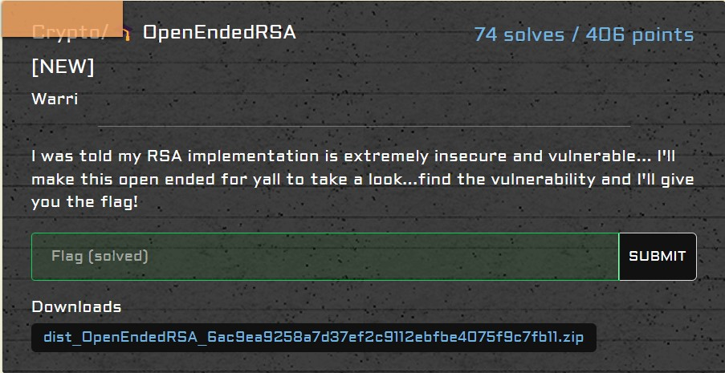

# crypto/OpenEndedRSA

<p align = "center"></p>

Ah yes, my favourite — textbook RSA:

```python
from Crypto.Util.number import *
from gmpy2 import iroot # this helps with super accurate square root calculations!

flag = b'????????????????????????'
m = bytes_to_long(flag)
e = 0x10001
pp = bytes_to_long(b'????????????????')
s = 1
assert isPrime(pp)

while not isPrime(s):
    p = getPrime(512)
    s = p**2 + pp**2 

assert iroot(s-pp**2,2) == (p, True)  # quick demo on how to use iroot()
assert s%2 == 1                       # duh, s is a prime number after all!

q = getPrime(512)
n = p*q
c = pow(m,e,n)

print(f'n = {n}')
print(f'e = {e}')
print(f'c = {c}')
print(f's = {s}')
```

From the above, there are few pieces of important information to take note:

1. `s` is clearly a <a href = "https://en.wikipedia.org/wiki/Fermat%27s_theorem_on_sums_of_two_squares">Pythagorean Prime</a> with `s % 4 = 1`.
2. `s = p**2 + pp**2`, where `p` is **much** larger than `pp`.
3. Challenge wants you to use `gmpy2.iroot()`, though a normal square root function would suffice.

From the second information, we can find `p` easily if we square root `s`, as `pp` is negligible relative to `p`. Other than that, we can solve for flag using the textbook RSA algorithm.

```python
from Crypto.Util.number import long_to_bytes

def sqrt(n):
    x = n
    y = (x + 1) // 2
    while y < x:
        x = y
        y = (x + n // x) // 2
    return x

def egcd(a, b):
    if a == 0:
        return (b, 0, 1)
    else:
        g, y, x = egcd(b % a, a)
        return (g, x - (b // a) * y, y)

def modinv(a, m):
    g, x, y = egcd(a, m)
    if g != 1:
        raise Exception('modular inverse does not exist')
    else:
        return x % m
    
n = 102273879596517810990377282423472726027460443064683939304011542123196710774901060989067270532492298567093229128321692329740628450490799826352111218401958040398966213264648582167008910307308861267119229380385416523073063233676439205431787341959762456158735901628476769492808819670332459690695414384805355960329
e = 65537
c = 51295852362773645802164495088356504014656085673555383524516532497310520206771348899894261255951572784181072534252355368923583221684536838148556235818725495078521334113983852688551123368250626610738927980373728679163439512668552165205712876265795806444660262239275273091657848381708848495732343517789776957423
s = 128507372710876266809116441521071993373501360950301439928940005102517141449185048274058750442578112761334152960722557830781512085114879670147631965370048855192288440768620271468214898335819263102540763641617908275932788291551543955368740728922769245855304034817063220790250913667769787523374734049532482184053
p = sqrt(s)
q = n // p
euler_totient = (p - 1) * (q - 1)
d = modinv(e, euler_totient)
m = pow(c, d, n)
print(long_to_bytes(m))
```

We can then obtain the flag:

```
SEE{0dd_3vEN:deadbeef}
```