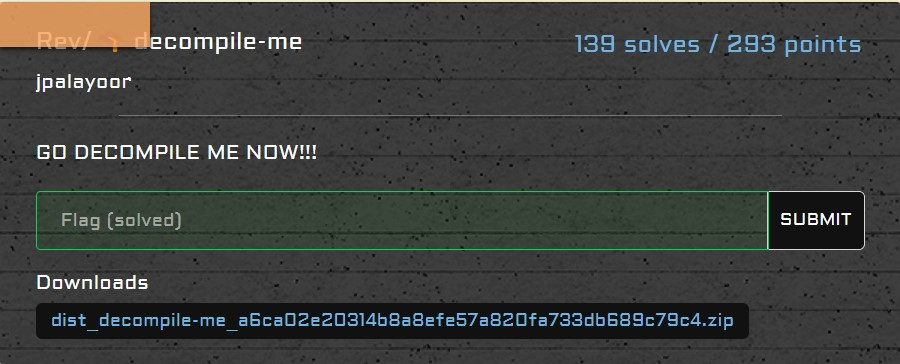

# rev/decompile-me

<p align = "center"></p>

A `.pyc` file was given along with an output. Decompiling the file using this <a href ="https://www.toolnb.com/tools-lang-en/pyc.html">tool</a> revealed to me the following code:

```python
from pwn import xor
with open('flag.txt', 'rb') as (f):
    flag = f.read()
a = flag[0:len(flag) // 3]
b = flag[len(flag) // 3:2 * len(flag) // 3]
c = flag[2 * len(flag) // 3:]
a = xor(a, int(str(len(flag))[0]) + int(str(len(flag))[1]))
b = xor(a, b)
c = xor(b, c)
a = xor(c, a)
b = xor(a, b)
c = xor(b, c)
c = xor(c, int(str(len(flag))[0]) * int(str(len(flag))[1]))
enc = a + b + c
with open('output.txt', 'wb') as (f):
    f.write(enc)
```

Well, it's just XOR ain't it. We can get the flag by reversing the order of the code given:

```python
from pwn import xor
with open('output.txt', 'rb') as f:
    flag = f.read()
    f.close()
one, two = list(str(len(flag)))
a = flag[0:len(flag) // 3]
b = flag[len(flag) // 3:2 * len(flag) // 3]
c = flag[2 * len(flag) // 3:]
c = xor(c, int(one) * int(two))
c = xor(b, c)
b = xor(a, b)
a = xor(c, a)
c = xor(b, c)
b = xor(a, b)
a = xor(a, int(one) + int(two))
print((a + b + c).decode())
```

Our code outputs the flag as such:

```
SEE{s1mP4l_D3c0mp1l3r_XDXD}
```