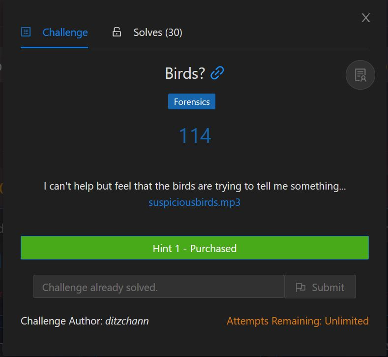
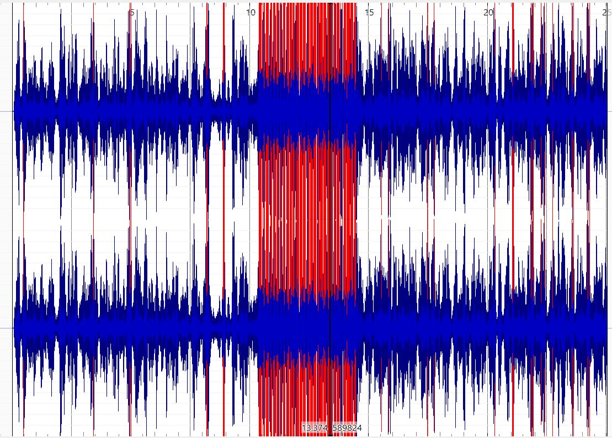
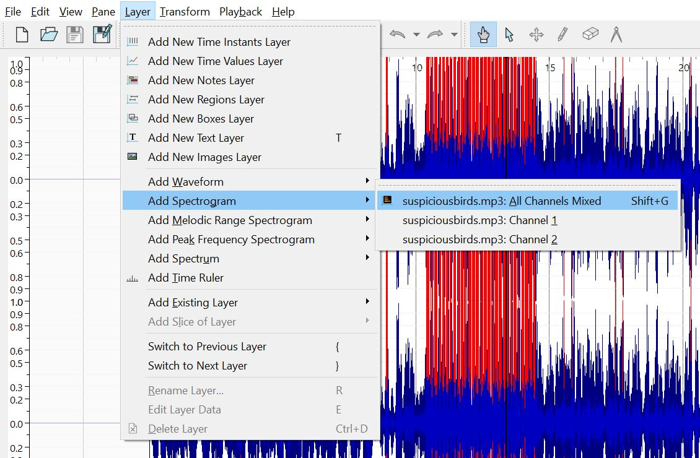
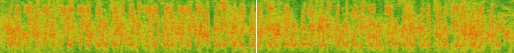

# Birds?

<p align = "center"></p>

**Hint 1:** you may want to google for other instances of mp3 files in CTFs

You can hear the sound of birds chirping when you open the mp3 file. The sound gets louder in the middle of the mp3, which could mean something. We can open up Sonic Visualiser to analyse the file.

<p align = "center"></p>

Indeed, the center part of the audio file seems to be louder. it could be possible that it is using audio steganography to hide something from us. We should visualise the audio using a spectrogram.

<p align = "center"></p>

We see some numbers and letters that look like hexadecimal representation. 

<p align = "center"></p>

Decoding it leads us to a pastebin https://pastebin.com/ZzkaFYiL, which then gives us the flag:

```
IRS{s0m3Th1n9_5ouNDs_w3iRd}
```