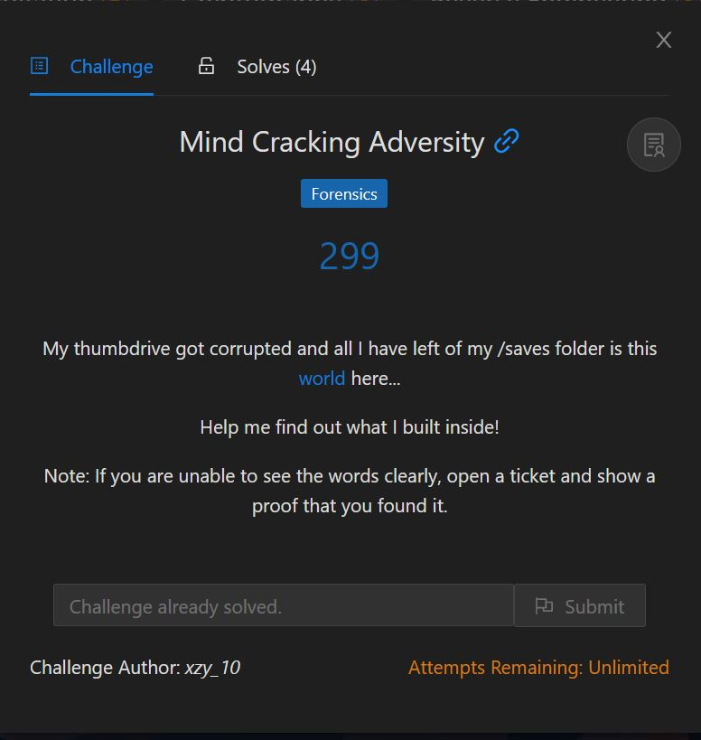
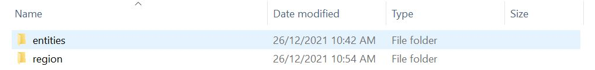
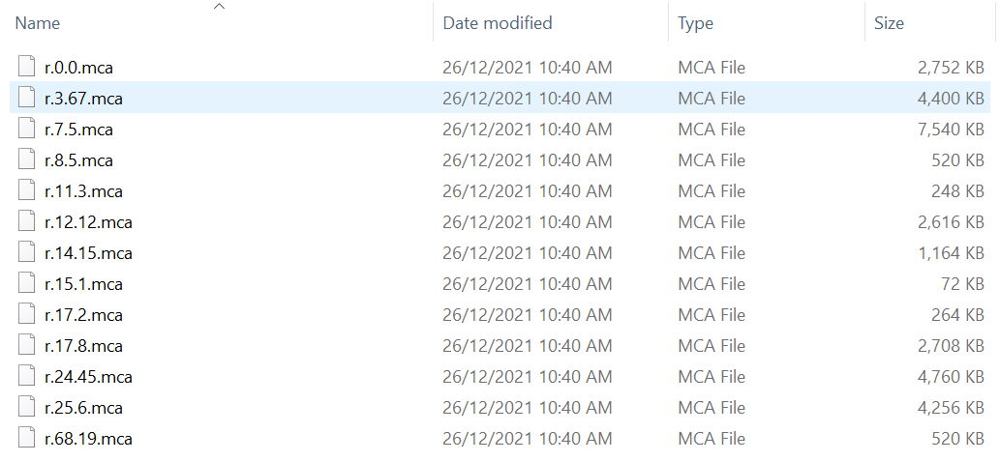
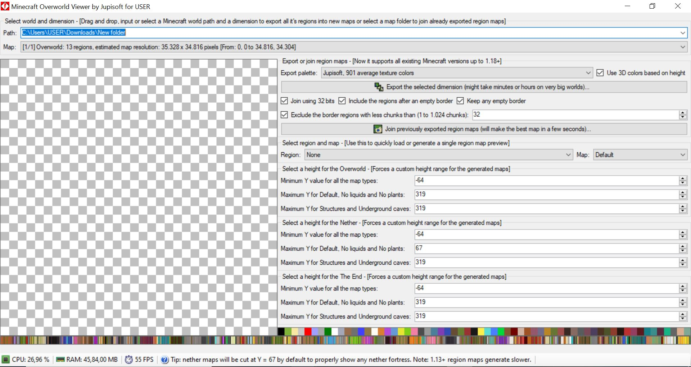
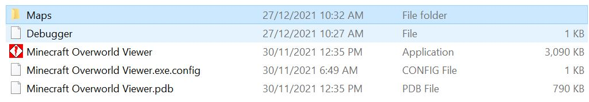
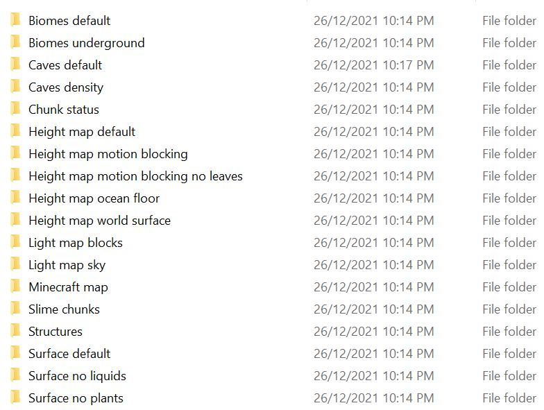
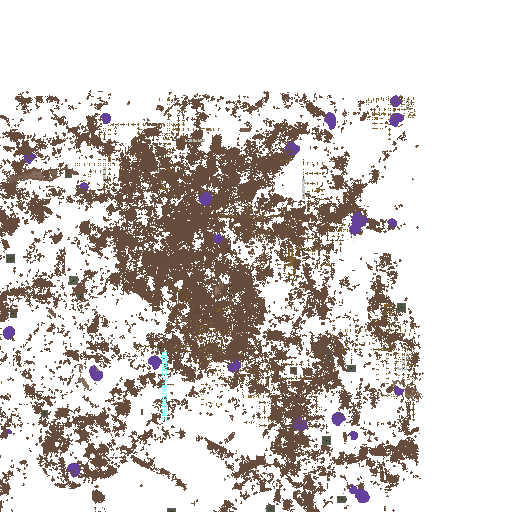

# Mind Cracking Adversity



*Za warudo*? Built inside? Sounds a lot like Minecraft, but we should take a look at what we were provided first. It's a zip file with 2 folders: entities and region.



Since the region folder only contains .mca files, we know that we are currently dealing with a Minecraft world. 



However, the problem is accessing the world. I did think of entering the world via the Minecraft launcher, but since the world is so big, I would probably have a hard time finding it (plus I haven't updated my Minecraft yet). There should be another alternative to view the world, so I googled "Minecraft MCA file viewer", and after scrolling through some websites I found this: https://www.minecraftforum.net/forums/mapping-and-modding-java-edition/minecraft-tools/3110507-new-minecraft-overworld-viewer-capable-of. This will link you to a Github repository where you can download the Minecraft Overworld Viewer. The interface is as shown below, and to access your world, type in the path where you stored your entities and region folder. In my case, my folders are in in C:\Users\USER\Downloads\New folder.



Click on "Export the selected dimension" and it will convert your world into images. You can access the images in the same folder where Minecraft Overworld Viewer is located under the Maps folder.



Since it is a structure being built, we can check the Structures folder first.



You will see a *sus* image in r.7.5.png. Rotate the image to get the flag:

```
IRS{M1N3VI3W3R}
```

