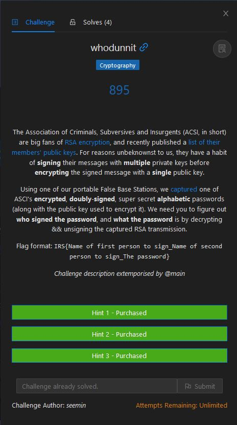

# whodunnit

<p align = "center"></p>

**Hint 1:** [Encryption: M^e % n = C] [Decryption: C^d % n = M] [Signing: M^d % n = S] [Unsigning S: S^e % n = M]

**Hint 2:** Obtaining a decryption key (d) is not necessary at any point in this challenge.

**Hint 3:** try to read the bolded words

The context of RSA encryption and hint 1 would give us an idea of how to attempt this challenge. We were given a list of ACSI's members' public keys and the captured encrypted message (password). Since 2 people from Suspicious_List.csv signed the message followed by encrypting the signed message with the public key which consists of the modulus *n* and public exponent *e*, we would need to decrypt the ciphertext *c* in interception.txt first. We would complete this entire challenge in python.

Since from hint 1 we know that encryption is done by M^e % n = C, we can get the decrypted signed message if we reverse this equation. We look at <a href = "https://stackoverflow.com/a/49823973">this answer</a> on how to do it using Carmichael's totient function *λ*(*n*) = lcm(*p* − 1, *q* − 1).

```python
import functools
import math

def egcd(a, b):
    """Extended gcd of a and b. Returns (d, x, y) such that
    d = a*x + b*y where d is the greatest common divisor of a and b."""
    x0, x1, y0, y1 = 1, 0, 0, 1
    while b != 0:
        q, a, b = a // b, b, a % b
        x0, x1 = x1, x0 - q * x1
        y0, y1 = y1, y0 - q * y1
    return a, x0, y0

def inverse(a, n):
    """Returns the inverse x of a mod n, i.e. x*a = 1 mod n. Raises a
    ZeroDivisionError if gcd(a,n) != 1."""
    d, a_inv, n_inv = egcd(a, n)
    if d != 1:
        raise ZeroDivisionError('{} is not coprime to {}'.format(a, n))
    else:
        return a_inv % n

def lcm(*x):
    """
    Returns the least common multiple of its arguments. At least two arguments must be
    supplied.
    :param x:
    :return:
    """
    if not x or len(x) < 2:
        raise ValueError("at least two arguments must be supplied to lcm")
    lcm_of_2 = lambda x, y: (x * y) // math.gcd(x, y)
    return functools.reduce(lcm_of_2, x)

def carmichael_pp(p, e):
    phi = pow(p, e - 1) * (p - 1)
    if (p % 2 == 1) or (e >= 2):
        return phi
    else:
        return phi // 2

def carmichael_lambda(pp):
    """
    pp is a sequence representing the unique prime-power factorization of the
    integer whose Carmichael function is to be computed.
    :param pp: the prime-power factorization, a sequence of pairs (p,e) where p is prime and e>=1.
    :return: Carmichael's function result
    """
    return lcm(*[carmichael_pp(p, e) for p, e in pp])
```

In RSA, we must note that the public exponent *e* must be coprime to Euler's totient function *ϕ*(*n*) = (*p* - 1)(*q* - 1), where *p* and *q* are primes and *n* = *p* ⋅ *q*. This is explained clearly by <a href = "https://crypto.stackexchange.com/a/12256">this answer</a>. If *e* is coprime to Euler's totient function *ϕ*(*n*), we can easily find the original message *m*. We can use the functions above and assume the following values below.

```python
# Do not add this to your final code, this is just an example
original_m = 9001
e = 5
p = 612967153686509396147
q = 2651978035382824985659
n = p * q # 1625575427987751336222433639706744024855873
c = pow(original_m, e, n)
lam = carmichael_lambda([(p, 1), (q, 1)])
guessed_m = pow(c, inverse(e, lam), n)
assert original_m == guessed_m
```

However, this method doesn't work for this challenge since *e* = 3 is not coprime to Euler's totient function *ϕ*(*n*). After much googling, I finally found a <a href = "https://github.com/HackThisSite/CTF-Writeups/blob/master/2017/EasyCTF/RSA%204/README.md">writeup with a similar problem</a>. Through the method that the writeup used, we are able to obtain the decrypted signed message. Note that I have obtained the factors of *n*, *p* and *q*, through <a href = "http://factordb.com/">FactorDB</a>, and used the functions declared above.

```python
import sympy

e = 3
p = 612967153686509396147
q = 2651978035382824985659
n = p * q # 1625575427987751336222433639706744024855873
c = 219299933729115529784559411697089963323
totient = (p - 1) * (q - 1)
gcd = egcd(e, totient)[0]
c = pow(c, inverse(e // gcd, totient), n)
signed_m = sympy.root(c, gcd)
```

We found that the decrypted signed message is 6030400648547 in decimal, hurray! However, our work is not done yet, as we would need to unsign the message using S^e % n = M. But who are the two people that signed the message? We can find them by iterating through every pair possible, and since we know that the passwords are alphabetic, this would weed out a lot of potential options.

We can add the following code.

```python
from Crypto.Util.number import long_to_bytes
from factordb.factordb import FactorDB

with open("Suspicious_List.csv", "r") as f:
    e = {}
    n = {}
    f.readline()
    for line in f:
        name, e_temp, n_temp = line.split(",")
        e[name] = int(e_temp)
        n[name] = int(n_temp)
    f.close()

for name2 in e:
    for name1 in e:
        try:
            m = long_to_bytes(pow(pow(signed_m, e[name1], n[name1]), e[name2], n[name2])).decode('ascii')
            if m.isalpha():
                print(name1, name2, m)
        except:
            continue
```

Only one result was returned, which was "Bermet Gil DWUH". Based on the flag format, the flag is:

```
IRS{Bermet_Gil_DWUH}
```