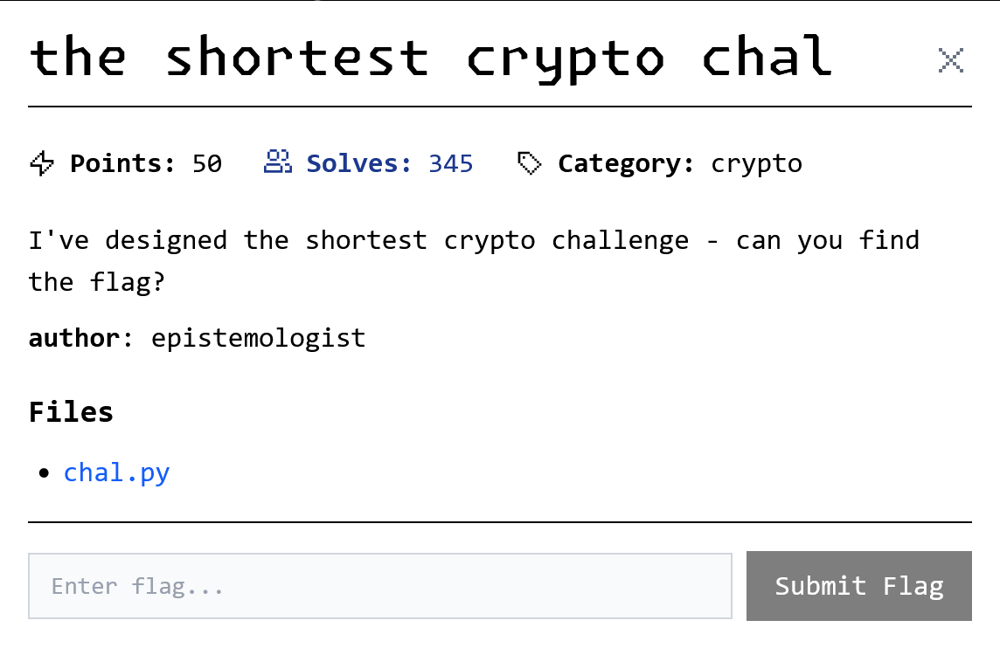

# the shortest crypto chal

<p align = "center"></p>

A peek into the code shows a one-liner assertion, but it isn't as simple as it looks.

```python
from Crypto.Cipher import AES

assert a**4 + b**4 == c**4 + d**4 + 17 and max(a,b,c,d) < 2e4 and \
    AES.new(f"{a*b*c*d}".zfill(16).encode() , AES.MODE_ECB).encrypt(FLAG).hex() == "41593455378fed8c3bd344827a193bde7ec2044a3f7a3ca6fb77448e9de55155"
```

The first 2 things that pop out instantly were the ECB mode used by AES, and $a^4+b^4=c^4+d^4+17$ with bounds $a,b,c,d\in\mathbb{Z}_{<20000}^{+}$. Apparently ECB was also used by another challenge, so we can rule that out as a strong attack vector here. Instead, we focus on the Diophantine equation. My first attempt was to solve it with z3py and sympy for positive solutions but without avail.

It took me a while, but after staring at the equation for some time, I realized that this is essentially just a 4-SUM due to the bounds given. As such, I did an exhaustive search to get the flag.

```python
from Crypto.Cipher import AES
from tqdm.auto import tqdm

d = {}
for i in tqdm(range(1, 20000)):
    for j in range(i, 20000):
        a = pow(i, 4)
        b = pow(j, 4)
        if a + b in d:
            k, l = d[a + b]
            print(AES.new(f"{i * j * k * l}".zfill(16).encode(), AES.MODE_ECB).decrypt(bytes.fromhex("41593455378fed8c3bd344827a193bde7ec2044a3f7a3ca6fb77448e9de55155")))
        d[a + b - 17] = (i, j)
```

```
uiuctf{D1oPh4nTine__Destr0yer__}
```