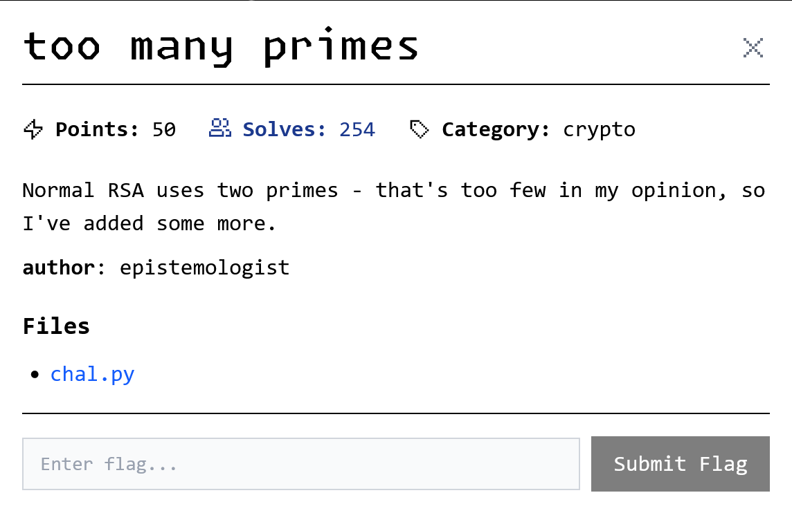

# too many primes

<p align = "center"></p>

It's a multi-prime RSA. It looks difficult, but the code below says otherwise:

```python
from sympy import nextprime, randprime

p = randprime(2**127, 2**128)
N = 1
while N < 2**2048:
    N *= p
    p = nextprime(p)
```

If you haven't realized, all of the primes are close to each other! So either Fermat's factorization, or root approximation, could work. I decided to go with root approximation then find the nearby primes, because Fermat's factorization works best for only 2 primes.

## Intended Solution

There are $\lceil\frac{2048}{127}\rceil=17$ primes that make up $N$, so we need to find the 17th root of $N$ to obtain a number close to the primes used. Note that `gmpy2.get_context().precision = 200` is absolutely necessary for accurate root approximation, otherwise you will never find any of the primes used.

```python
import gmpy2
from sympy import nextprime, prevprime, isprime
from Crypto.Util.number import long_to_bytes

n = 34546497157207880069779144631831207265231460152307441189118439470134817451040294541962595051467936974790601780839436065863454184794926578999811185968827621504669046850175311261350438632559611677118618395111752688984295293397503841637367784035822653287838715174342087466343269494566788538464938933299114092019991832564114273938460700654437085781899023664719672163757553413657400329448277666114244272477880443449956274432819386599220473627937756892769036756739782458027074917177880632030971535617166334834428052274726261358463237730801653954955468059535321422372540832976374412080012294606011959366354423175476529937084540290714443009720519542526593306377
c = 32130352215164271133656346574994403191937804418876038099987899285740425918388836116548661879290345302496993945260385667068119439335225069147290926613613587179935141225832632053477195949276266017803704033127818390923119631817988517430076207710598936487746774260037498876812355794218544860496013734298330171440331211616461602762715807324092281416443801588831683678783343566735253424635251726943301306358608040892601269751843002396424155187122218294625157913902839943220894690617817051114073999655942113004066418001260441287880247349603218620539692362737971711719433735307458772641705989685797383263412327068222383880346012169152962953918108171850055943194
e = 65537

gmpy2.get_context().precision = 200
root = int(gmpy2.root(n, 17))
phi = root if isprime(root) else 1

p = nextprime(root)
while n // p * p == n:
    phi *= p - 1
    p = nextprime(p)

p = prevprime(root)
while n // p * p == n:
    phi *= p - 1
    p = prevprime(p)

d = pow(e, -1, phi) # modinv for python 3.8+
print(long_to_bytes(pow(c, d, n)))
```

## Unintended Solution

Some guy leaked all of the primes on factorDB (lol), so just do this:

```python
from math import prod
from Crypto.Util.number import long_to_bytes
from factordb.factordb import FactorDB

n = 34546497157207880069779144631831207265231460152307441189118439470134817451040294541962595051467936974790601780839436065863454184794926578999811185968827621504669046850175311261350438632559611677118618395111752688984295293397503841637367784035822653287838715174342087466343269494566788538464938933299114092019991832564114273938460700654437085781899023664719672163757553413657400329448277666114244272477880443449956274432819386599220473627937756892769036756739782458027074917177880632030971535617166334834428052274726261358463237730801653954955468059535321422372540832976374412080012294606011959366354423175476529937084540290714443009720519542526593306377
c = 32130352215164271133656346574994403191937804418876038099987899285740425918388836116548661879290345302496993945260385667068119439335225069147290926613613587179935141225832632053477195949276266017803704033127818390923119631817988517430076207710598936487746774260037498876812355794218544860496013734298330171440331211616461602762715807324092281416443801588831683678783343566735253424635251726943301306358608040892601269751843002396424155187122218294625157913902839943220894690617817051114073999655942113004066418001260441287880247349603218620539692362737971711719433735307458772641705989685797383263412327068222383880346012169152962953918108171850055943194
e = 65537
f = FactorDB(n)
f.connect()
p_list = f.get_factor_list()

phi = prod([p - 1 for p in p_list])
d = pow(e, -1, phi) # modinv for python 3.8+
print(long_to_bytes(pow(c, d, n)))
```

We get the flag:

```
uiuctf{D0nt_U5e_Cons3cUt1vE_PriMeS}
```