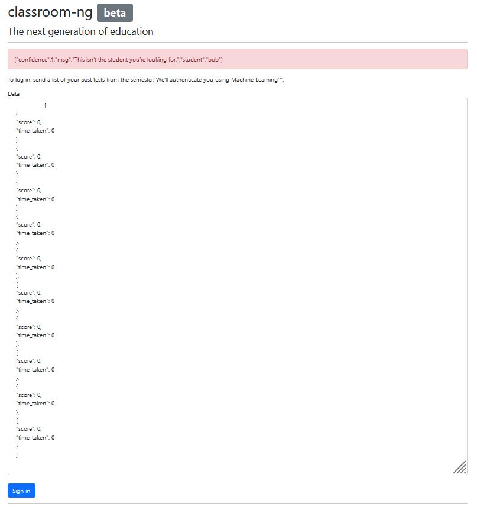
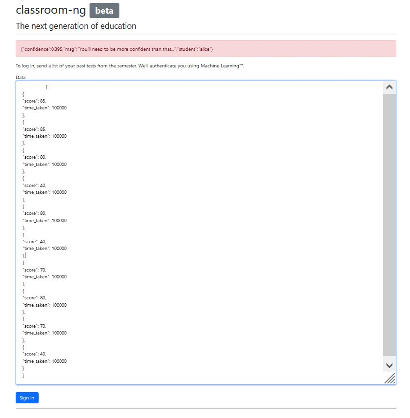

# ml/classroom

<p align = "center"></p>

This was the first challenge that I solved, and the only challenge in this CTF that I claimed first blood. The challenge was one of the easiest, yet the fact that it only has 6 solves confused me.

Taking a look below at what the <a href = "https://classroom.challs.wreckctf.com/">classroom</a> looks like, seems like a machine learning algorithm is used to classify the input that we key in as one of the students in the dataset. The algorithm also provides a "confidence" level that is between the values of 0 and 1, which refers to the level of certainty that the algorithm thinks that the input data represents a particular student. We note the message "This isn't the student you're looking for", meaning to say that we need to find a student other than Bob.

Note that the output in red only tells us the student with the highest confidence level and the corresponding value.

<p align = "center"></p>

This is literally the essence of hyperparameter tuning, but doing it manually. We would increase or decrease a parameter to see the effects on confidence and the student in question. After much searching, we found the student that we were looking for: Alice. What I have also noticed is that the time_taken variable can be increased to very large values for Alice which has no effect on the confidence level, whereas decreasing time_taken would only decrease the confidence level for Alice. This means that Alice might very well be the upper bound for time_taken.

<p align = "center"></p>

After some rounds of hyperparameter tuning, we get our answer:

<p align = "center"></p>

This gives us the flag:

```
flag{youre_pr0bably_c0rrect}
```