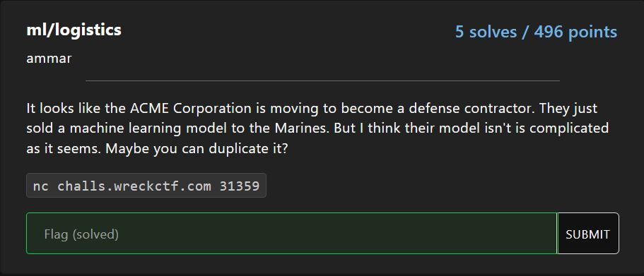
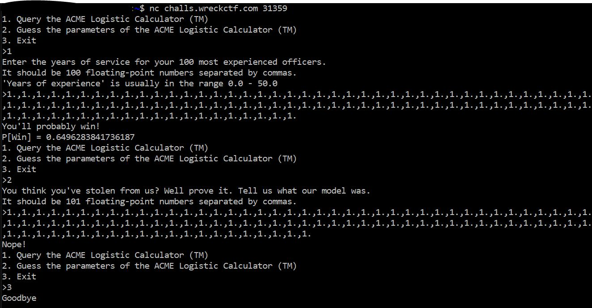
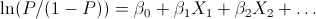

# ml/logistics

<p align = "center"></p>

Logistic Calculator? I instantly thought of logistic regression. This was further proved by the fact that the number of input values into the logistic calculator is 1 less than the number of parameters for it.

<p align = "center"></p>

We can use the following formula to determine the parameter beta by making 101 loops, where we change the <i>i</i>th x from 0 to 1 on the <i>i</i>th loop, since the probability is output by the server.

<p align = "center"></p>

We make a function based on the above formula as such:

```python
import numpy as np

beta = []
x = [str(0.) for _ in range(101)]

def find_next_beta(p):
    if beta:
        beta.append(np.log(p / (1 - p)) - beta[0] - sum([float(x[i - 1]) * beta[i] for i in range(1, len(beta))]))
    else:
        beta.append(np.log(p / (1 - p)))
```

The main code would be as such:

```python
from pwn import *

target = remote("challs.wreckctf.com", 31359)

received = b""
while b">" not in received:
    received += target.recv(1024)
target.sendline("1")
beta = []
x = [str(0.) for _ in range(101)]
received = b""
while b">" not in received:
    received += target.recv(1024)
for i in range(101):
    target.sendline(",".join(x[:-1]))
    received = b""
    while b">" not in received:
        received += target.recv(1024)
    find_next_beta(np.float64(received.decode().replace("You'll probably win!\nP[Win] = ", "").replace("\n1. Query the ACME Logistic Calculator (TM)\n2. Guess the parameters of the ACME Logistic Calculator (TM)\n3. Exit\n>", "")))
    x[i] = str(1.)
    if i < 100:
        target.sendline("1")
        received = b""
        while b">" not in received:
            received += target.recv(1024)

target.sendline("2")
received = b""
while b">" not in received:
    received += target.recv(1024)
target.sendline(",".join([str(b) for b in beta]))
received = b""
while b"\n" not in received:
    received += target.recv(1024)
print(received.decode().split("\n")[-2])

target.close()
```

This gives us the flag:

```
flag{l1Ne4R_aL6eBra_ftW}
```