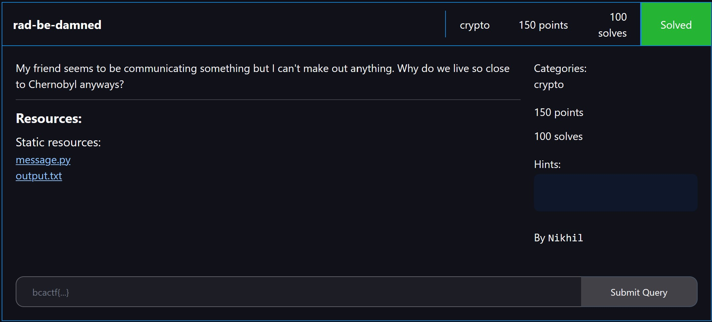

# crypto/rad-be-damned

<p align = "center"></p>

<details> 
  <summary><b>Hint 1</b></summary>
   Encoded with CRC (Cyclic Redundancy Checks)
</details>

We were given an `output.txt` file which contains binary numbers:

```
011000001011010000111000011000111110011000111100011101001100001001100111011111110110011110010100011100010111011011111001010011011011010100011010001010011110010110010000001110111010001000011100011100011100010011111101010101101011110000110010001101100011011010100011001001010010001011011111011110000010001101100110010000110011011101110101010010111000011100011001010100011001001000111000001101010001011000100111010011000001011100011111111101010111010001001000001101000000001101011100010101101010101011011110011010100010010010010011010101010101010000010000001011011100011000011010010000111110001110011111011100011101010110001010010100100111001110011100011010101000011000101010001000101001001100011101111101100010010011100000010101111010011101101000011100100101001001000001010001111111010001001101111110100101011111001100
```

We were also given the code for the encryption process:

```python
import random
def find_leftmost_set_bit(plaintext):
    pos = 0
    while plaintext > 0:
        plaintext = plaintext >> 1
        pos += 1
    return pos

def encrypt(plaintext: str):
    enc_plaintext = ""

    for letter in plaintext:
        cp = int("10011", 2)
        cp_length = cp.bit_length()
        bin_letter, rem = ord(letter), ord(letter) * 2**(cp_length - 1)
        while (rem.bit_length() >= cp_length):
            first_pos = find_leftmost_set_bit(rem)
            rem = rem ^ (cp << (first_pos - cp_length))
        enc_plaintext += format(bin_letter, "08b") + format(rem, "0" + f"{cp_length - 1}" + "b")

    return enc_plaintext

def rad(text: str):
    corrupted_str = ""
    for ind in range(0, len(text), 12):
        bit_mask = 2 ** (random.randint(0, 11))
        snippet = int(text[ind : ind + 12], base = 2)
        rad_str = snippet ^ bit_mask
        corrupted_str += format(rad_str, "012b")
    return corrupted_str

def main():
    with open('flag.txt') as f:
        plaintext = f.read().strip()
    enc_plaintext = encrypt(plaintext)
    cor_text = rad(enc_plaintext)
    print(cor_text)

if __name__ == '__main__':
    main()
```

We see that encryption is done via a two-step process - `encrypt()`, followed by `rad()`. `encrypt()` converts each character in the plaintext into 12 bits, with the first 8 bits being the ASCII value for the character and the last 4 bits being the [Cyclic Redundancy Check (CRC)](https://en.wikipedia.org/wiki/Cyclic_redundancy_check) that is applied to that character.  `rad()` then tries to corrupt one of the 12 bits for each character.

Since we have CRC in place, we can find the corrupted bit as described [here](https://stackoverflow.com/a/55921741). In short, we can do a dictionary attack for each letter, where all 12 bits of `(guessed_letter + guessed_letter_CRC) ^ (enc_letter + enc_letter_CRC)` should be 0 except for one of them.

We then correct the bits for each letter as such:

```python
def find_leftmost_set_bit(plaintext):
    pos = 0
    while plaintext > 0:
        plaintext = plaintext >> 1
        pos += 1
    return pos

def encrypt(plaintext: str):
    enc_plaintext = ""

    for letter in plaintext:
        cp = int("10011", 2)
        cp_length = cp.bit_length()
        bin_letter, rem = ord(letter), ord(letter) * 2**(cp_length - 1)
        while (rem.bit_length() >= cp_length):
            first_pos = find_leftmost_set_bit(rem)
            rem = rem ^ (cp << (first_pos - cp_length))
        enc_plaintext += format(bin_letter, "08b") + format(rem, "0" + f"{cp_length - 1}" + "b")

    return enc_plaintext

# how CRC can be used for bit correction: https://stackoverflow.com/a/55921741
output = "011000001011010000111000011000111110011000111100011101001100001001100111011111110110011110010100011100010111011011111001010011011011010100011010001010011110010110010000001110111010001000011100011100011100010011111101010101101011110000110010001101100011011010100011001001010010001011011111011110000010001101100110010000110011011101110101010010111000011100011001010100011001001000111000001101010001011000100111010011000001011100011111111101010111010001001000001101000000001101011100010101101010101011011110011010100010010010010011010101010101010000010000001011011100011000011010010000111110001110011111011100011101010110001010010100100111001110011100011010101000011000101010001000101001001100011101111101100010010011100000010101111010011101101000011100100101001001000001010001111111010001001101111110100101011111001100"
dictionary = {int(encrypt(chr(i)), 2): chr(i) for i in range(256)}
result = ""
for i in range(0, len(output), 12):
    x = int(output[i:i + 12], 2)
    for y in dictionary:
        check = bin(x ^ y)[2:].replace("0", "")
        if check == "1":
            result += dictionary[y]

print("Flag:", result)
```

We then output the flag:

```
bcactf{yumMY-y311OWC4ke-x7CwKqQc5fLquE51V-jMUA-aG9sYS1jb21vLWVzdGFz}
```