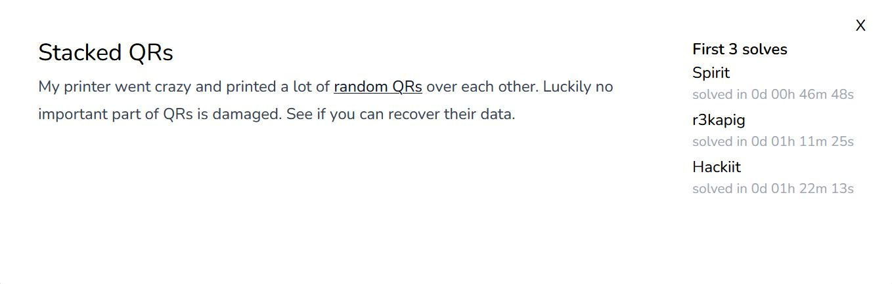
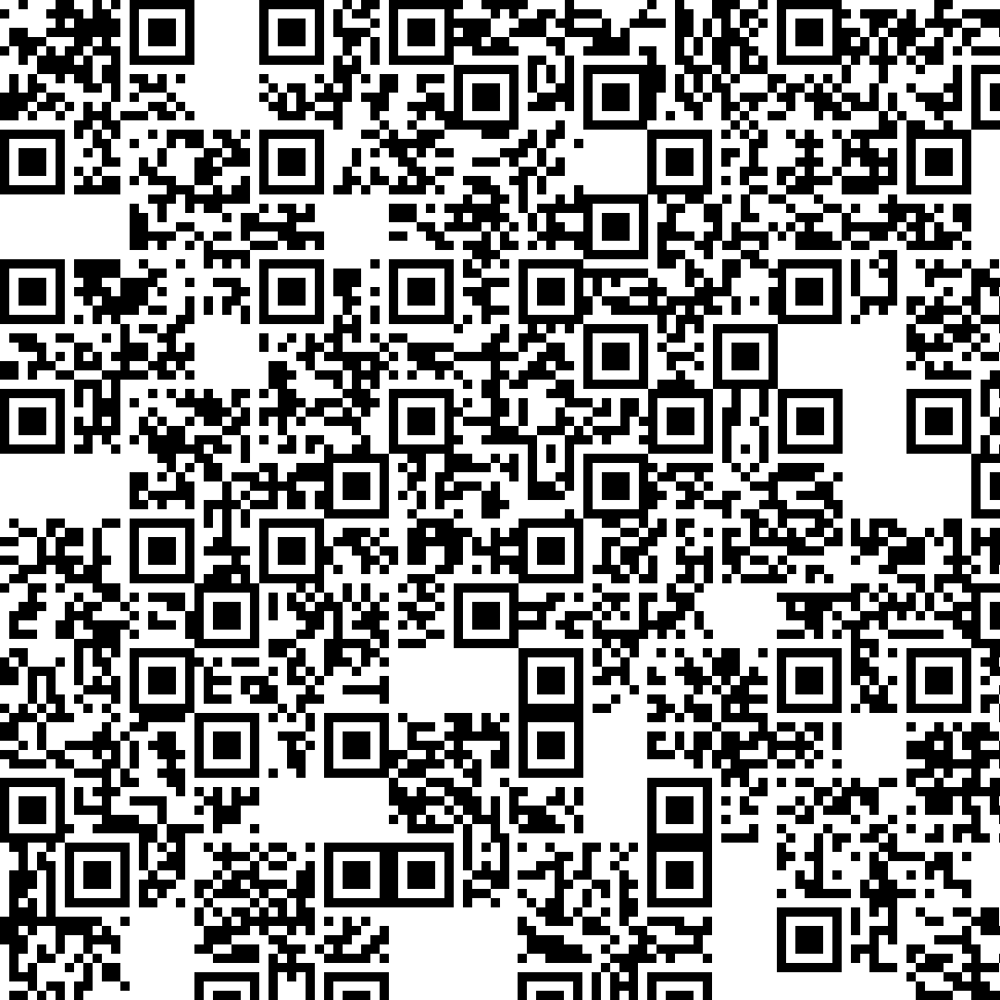

# forensics/Stacked QRs

<p align = "center"></p>

All they give you is this:

<p align = "center"></p>

Each QR code must have 3 position markers (aka big squares) at the corners so that the QR scanner can determine the orientation of the QR code. Most of them in this picture only have 1 or 2, meaning to say we have to create the position markers and insert those at the correct position for them. After much searching, I found 3 QR codes that were not randomized strings.

The first one is at the centre and is second from the top:

<p align = "center"></p>

```
ASIS{7iM3_70_f
```

The second one is at the centre, with a blob that looks like <b>amogus</b>.

<p align = "center"></p>

```
ix_7Hi5_0ld_di
```

The last one is at the bottom right corner.

<p align = "center"></p>

```
R7y_PRin73R!!}
```

Combining all 3 parts gives the following flag:

```
ASIS{7iM3_70_fix_7Hi5_0ld_diR7y_PRin73R!!}
```