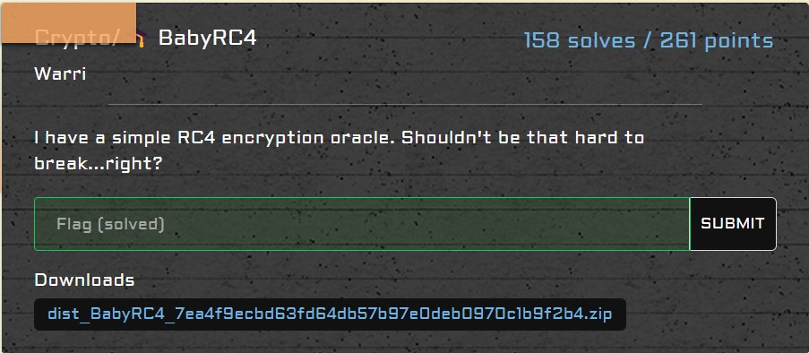

# crypto/BabyRC4

<p align = "center"></p>

This was by far the easiest challenge (other than the sanity check, of course). The code given is fairly simple:

```python
from Crypto.Cipher import ARC4
from os import urandom
key = urandom(16)
flag = b'SEE{?????????????????????????????????}'[::-1]

def enc(ptxt):
    cipher = ARC4.new(key)
    return cipher.encrypt(ptxt)

print(f"c0 = bytes.fromhex('{enc(flag).hex()}')")
print(f"c1 = bytes.fromhex('{enc(b'a'*36).hex()}')")

"""
c0 = bytes.fromhex('b99665ef4329b168cc1d672dd51081b719e640286e1b0fb124403cb59ddb3cc74bda4fd85dfc')
c1 = bytes.fromhex('a5c237b6102db668ce467579c702d5af4bec7e7d4c0831e3707438a6a3c818d019d555fc')
"""
```

Noting that the same key is used for both `c0` and `c1`, I knew something was up. As we know the plaintext for `c1`, this is likely to be a plaintext attack. The <a href= "https://crypto.stackexchange.com/a/45052">answer</a> here confirmed my suspicions. The main idea of the attack was to XOR known ciphertext `c0` and its plaintext to obtain the keystream used. Since the encryption was merely XORing the plaintext and the keystream, we can get back the plaintext by XORing the keystream again. I have done it as such:

```python
knownPlaintext = b'a' * 36
knownCiphertext = bytes.fromhex('a5c237b6102db668ce467579c702d5af4bec7e7d4c0831e3707438a6a3c818d019d555fc')
unknownCiphertext = bytes.fromhex('b99665ef4329b168cc1d672dd51081b719e640286e1b0fb124403cb59ddb3cc74bda4fd85dfc')

decrypted = bytearray()
for i in range(0, len(unknownCiphertext)):
    p = knownPlaintext[i % len(knownPlaintext)]
    c1 = knownCiphertext[i % len(knownCiphertext)]
    c0 = unknownCiphertext[i] 
    decrypted.append(p ^ c1 ^ c0)

print(decrypted[::-1])
```

The problem was that the unknown ciphertext `c1` was slightly longer than known ciphertext `c0`, which suggested that we were only able to retrieve a partial flag. Thankfully, since the flag was reversed, only our flag format was erased in our output. The above code yielded the following:

```python
bytearray(b'_\x99E{n3vEr_reU53_rC4_k3y5ss5s:cafe2835}')
```

Adding the flag format gives:

```
SEE{n3vEr_reU53_rC4_k3y5ss5s:cafe2835}
```