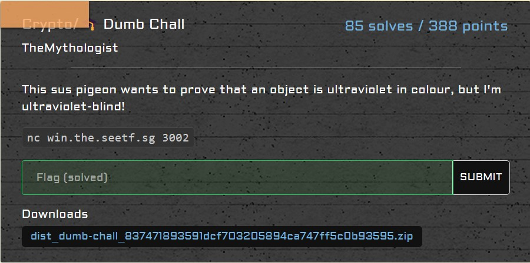

# crypto/Dumb Chall

<p align = "center"></p>

From the following code, I recognized that we needed to pass 2 verification functions `first_verify()` and `second_verify()`:

```python
import random
import time
from Crypto.Util.number import bytes_to_long, isPrime

from secret import FLAG


def fail():
    print("You have disappointed the pigeon.")
    exit(-1)


def generate_prime_number(bits: int = 128) -> int:
    num = random.getrandbits(bits)
    while not isPrime(num):
        num += 1
    return num


def generate_random_boolean() -> bool:
    return bool(random.getrandbits(1))


def first_verify(g, p, y, C, w, r) -> bool:
    assert w
    return ((y * C) % p) == pow(g, w, p)


def second_verify(g, p, y, C, w, r) -> bool:
    assert r
    return pow(g, r, p) == C


p = generate_prime_number()
g = random.getrandbits(128)
x = bytes_to_long(FLAG.encode())
y = pow(g, x, p)

print(f"p = {p}")
print(f"g = {g}")
print(f"y = {y}")

print("Something something zero-knowledge proofs blah blah...")
print("Why not just issue the challenge and the verification at the same time? Saves TCP overhead!")

seen_c = set()
for round in range(30):
    w, r = None, None
    choice = generate_random_boolean()
    if not choice:
        w = int(input("Enter w: "))
        C = int(input("Enter C: "))
        if C in seen_c:
            fail()
        seen_c.add(C)
        verify = first_verify
    else:
        r = int(input("Enter r: "))
        C = int(input("Enter C: "))
        if C in seen_c:
            fail()
        seen_c.add(C)
        verify = second_verify
    if not verify(g, p, y, C, w, r):
        fail()
    else:
        print(f"You passed round {round + 1}.")
time.sleep(1)
print(
    "You were more likely to get hit by lightning than proof correctly 30 times in a row, you must know the secret right?"
)
print(f"A flag for your troubles - {FLAG}")
```

We have to pass 30 rounds of verification while continuously changing the value of `C`. Through these 30 rounds, `p`, `g`, `x` and `y` are kept constant, and user input values `w` and `r` can be changed or remain constant.

To bypass `second_verify()` was relatively trivial; since we already know `g` and `p`, we technically can set `r` to be any number and we would still know what is `C`.

However, `first_verify()` was a different ball game. To satisfy `((y * C) % p) == pow(g, w, p)`, I first thought of using `w = 0` so that `pow(g, w, p) = 1` then using Fermat's little theorem to obtain `C = pow(y, p - 2)`. However, `p` was fairly large and didn't work because of the slow computational speed to calculate `C`.

But wait... what about `w = 1` so that `pow(g, w, p) = g % p`?  Even better, if `g < p`, `pow(g, w, p) = g`! To obtain `C`, we can get the modular multiplicative inverse of *y mod p* so that `(y * modinv(y, p)) % p = 1`. This can then be multiplied by `g` to satisfy `first_verify()`. As the value of `C` needs to be different, we can multiply our `C` by `p + 1` each time `first_verify()` is called as `(p + 1) % p = 1` and we can use the modular multiplication property.

This was the code I ran:

```python
from pwn import *

def egcd(a, b):
    if a == 0:
        return (b, 0, 1)
    else:
        g, y, x = egcd(b % a, a)
        return (g, x - (b // a) * y, y)

def modinv(a, m):
    g, x, y = egcd(a, m)
    if g != 1:
        raise Exception('modular inverse does not exist')
    else:
        return x % m

target = remote("win.the.seetf.sg", 3002)
multiplier = 1
for i in range(30):
    received = b""
    while b":" not in received:
        received += target.recv(4096)
    received = received.decode().split("\n")
    is_r = "w" not in received[-1]
    r = int(is_r) * i
    r += 1
    print(received)

    for line in received:
        try:
            exec(line)
        except:
            break

    assert y < p # y = pow(g, x, p)
    assert g < p # Gambling with Qingque be liek
    target.sendline(str(r))

    received = b""
    while b":" not in received:
        received += target.recv(4096)
    print(received)

    if is_r:
        target.sendline(str(pow(g, r, p)))
    else:
        # y * c % p = (y * c) % p = g
        target.sendline(str(modinv(y, p) * g * multiplier))
        multiplier *= (p + 1)

received = b""
while b"flag" not in received:
    received += target.recv(4096)
print(received.decode())

target.close()
```

We successfully gambled and won the flag:

```
SEE{1_571ll_h4v3_n0_kn0wl3d63}
```