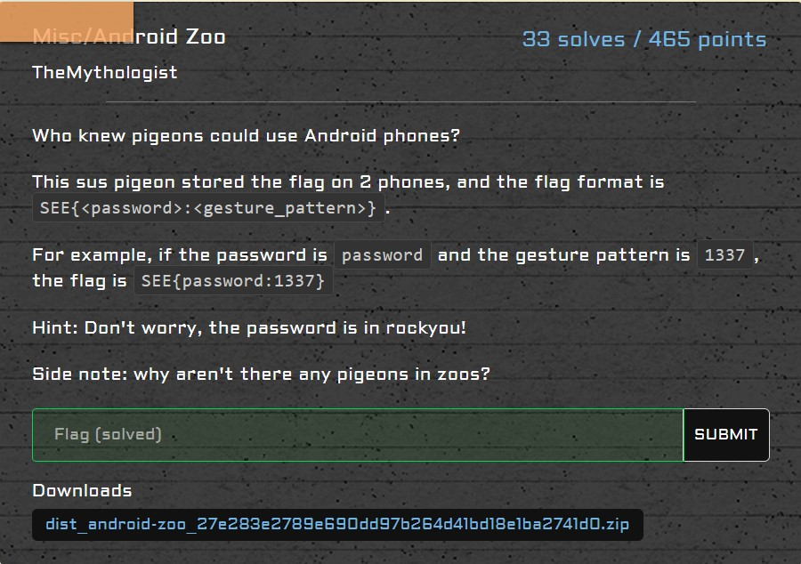
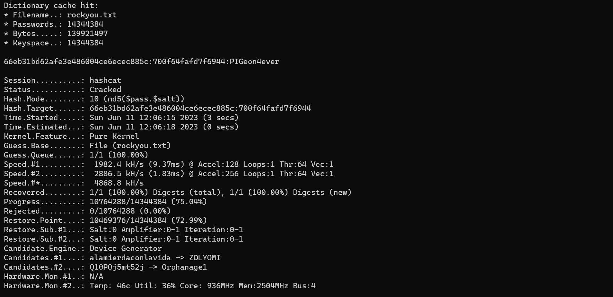

# misc/Android Zoo

<p align = "center"></p>

There are two devices that we need to unlock, with one using an alphanumeric password, and the other using a gesture pattern (numeric and digits are not repeated). We can find what type of password is used based on the code found in this <a href ="https://blog.mptolly.com/determining-the-type-of-security-lock-settings-on-an-android-device-in-xamarin/">webpage</a>.

These are the relevant information obtained from the first device:

* Android API 6.0 (`device.txt`)
* `len(password) = 5` (`device_policies.xml`)
* `user = 0` (`locksettings.db`)
* `lockscreen.password_salt = 545359896771541034` (`locksettings.db`)
* `lockscreen.password_type = 65536` (`locksettings.db`)

The first device uses a gesture pattern as `lockscreen.password_type = 65536`. Since the device involves an Android API 6.0, <a href = "https://source.android.com/docs/security/features/authentication/gatekeeper">Gatekeeper daemon</a> is used which is much more secure as compared to the previous password storage methods. `lockscreen.password_salt` is also useless in this particular Android version, as the hash is found within `gatekeeper.pattern.key` itself. Thankfully, the code provided by this <a href = "https://nelenkov.blogspot.com/2015/06/password-storage-in-android-m.html">website</a> gives us an idea on how to approach the challenge. 

After which, we brute force all possible gestures that can be used and match its signature to the hash that is computed by `scrypt`. This was the code that I used, which took quite some time to run:

```python
import struct
import scrypt
from Crypto.Util.number import *

N = 16384
r = 8
p = 1

with open("passwords.txt", "w") as f:
    for a in "123456789":
        for b in "123456789":
            for c in "123456789":
                for d in "123456789":
                    for e in "123456789":
                        password = a+b+c+d+e
                        if len({a,b,c,d,e}) == len(password):
                            f.write(password + "\n")
    f.close()

f = open('gatekeeper.pattern.key', 'rb')
blob = f.read()
f.close()
s = struct.Struct('<'+'17s 8s 32s')
meta, salt, signature = s.unpack_from(blob)
with open("passwords.txt", "r") as f:
    for password in f:
        to_hash = meta
        to_hash += password[:-1].encode()
        h = scrypt.hash(to_hash, salt, N, r, p)

        if h[0:32] == signature:
            print("Signature:", hex(bytes_to_long(signature))[2:])
            print("Hash:", hex(bytes_to_long(h[0:32]))[2:])
            print("Password:", password)
            break
    f.close()
```

I obtained the following results:

```
Signature: 8c6f2d4d5eb89748ca46b11da509abb1d7a1c80e802ed071c63d5d7ca9109319
Hash: 8c6f2d4d5eb89748ca46b11da509abb1d7a1c80e802ed071c63d5d7ca9109319
Password: 95184
```

As for the second device, the password was much easier to crack. These are the relevant information obtained from the second device:

* Android API 5.1 (`device.txt`)
* `len(password) = 11`, `uppercase = 3`,  `uppercase = 3`, `lowercase = 3`, `letters = 10`, `numeric = 1`, `symbols = 0`, `nonletter = 1` (`device_policies.xml`)
* `user = 0` (`locksettings.db`)
* `lockscreen.password_salt = 8074783686056175940` (`locksettings.db`)
* `lockscreen.password_type = 327680` (`locksettings.db`)

The hashed password and salt can be written in hex for easier operation later:

```
Password: 6dfe4d0c832761398b38d7cfad64d78760debad266eb31bd62afe3e486004ce6ecec885c
Salt: 700f64fafd7f6944
```

From this <a href ="https://www.web3us.com/cyber-security/breaking-samsung-android-passwordspin">resource</a>, we now know that the hashed password found in `password.key` is actually made up of two parts: the first 20 bytes was a SHA1 hash and the last 12 bytes was a MD5 hash. As we also know that the password can be found in <a href = "https://github.com/brannondorsey/naive-hashcat/releases/download/data/rockyou.txt">rockyou.txt</a>, we can use <a href= "https://hashcat.net/hashcat/">hashcat</a> to find the password which has a hash that matches with our password.  We parse it to hashcat on our command prompt as such:

```shell
hashcat.exe -m 10 -a 0 "66eb31bd62afe3e486004ce6ecec885c:700f64fafd7f6944" rockyou.txt
```

This gives us the correct password:

<p align = "center"></p>

We can combine the password and gesture to get the flag:

```
SEE{PIGeon4ever:95184}
```