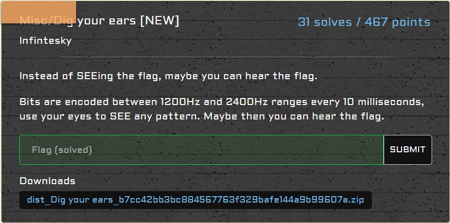
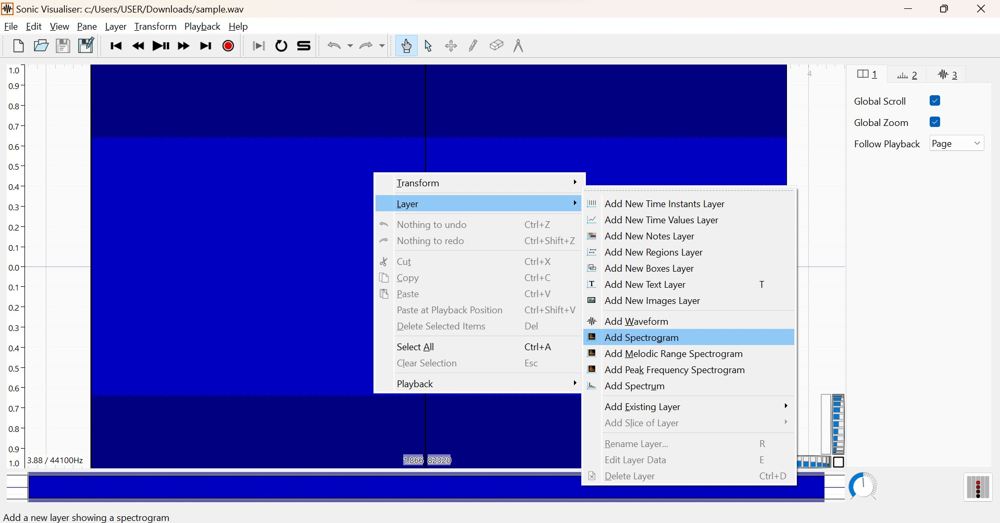
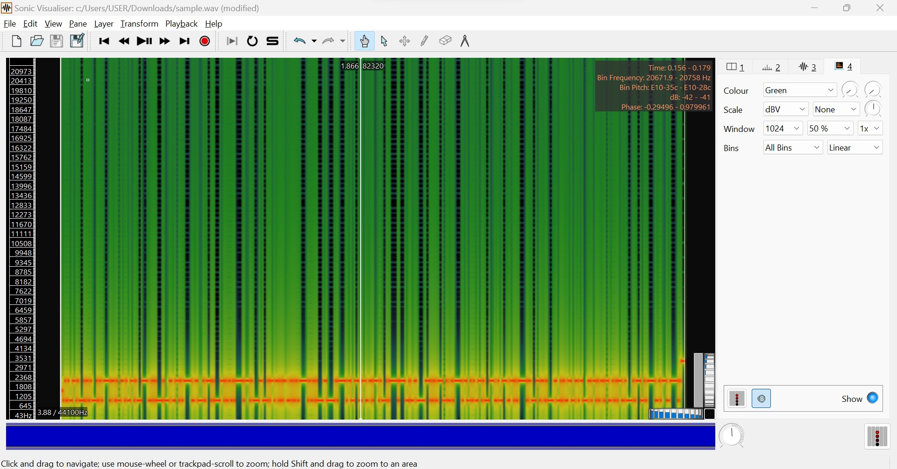

# misc/Dig your ears

<p align = "center"></p>

Opening `sample.wav` on <a href = "https://www.sonicvisualiser.org/">Sonic Visualiser</a> and adding a spectrogram layer gave me something similar to morse code.

<p align = "center"></p>

<p align = "center"></p>

Except that it ain't morse code, since no substantial results were obtained when running the file on a <a href = "https://morsecode.world/international/decoder/audio-decoder-adaptive.html">morse code decoder</a>. I read the question again and it says that "bits are encoded every 10 miliseconds". I manually recorded down all of the bits on a piece of paper, then converted it back to text through this code:

```python
from Crypto.Util.number import long_to_bytes

binary = [
    "010100110100010101000101011110110100110100",
    "11010001111001010000100011001101011111001100010111010000110",
    "101010111110111010000110001011011010110010101011111010101",
    "0000110000010111110110011100110011011101000101111101111001",
    "001100000111010101110010010111110110010100110100011100100",
    "1110011010111110110001101101000011001010011001101100011011",
    "01011011001010110010000101110010111110010111001111101"
    ]

binary = "".join(binary)

print(long_to_bytes(int(binary, 2)).decode())
```

The code outputs the flag:

```
SEE{M4yB3_1t5_t1me_T0_g3t_y0ur_e4rs_che3cked._.}
```