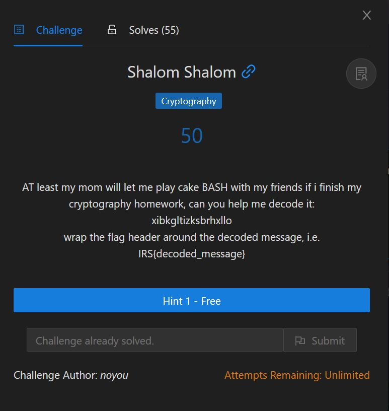

# Shalom Shalom

<p align = "center"></p>

One of the easiest cryptography challenges. If you don't know what cipher it is, you can always look through <a href = "http://practicalcryptography.com/ciphers/">this list</a> and test each one out one by one.

For this challenge, atbash cipher was used, and you can decode it using <a href = "https://www.dcode.fr/atbash-cipher">this link</a>. We get the decoded message "cryptographyiscool".

```
IRS{cryptographyiscool}
```