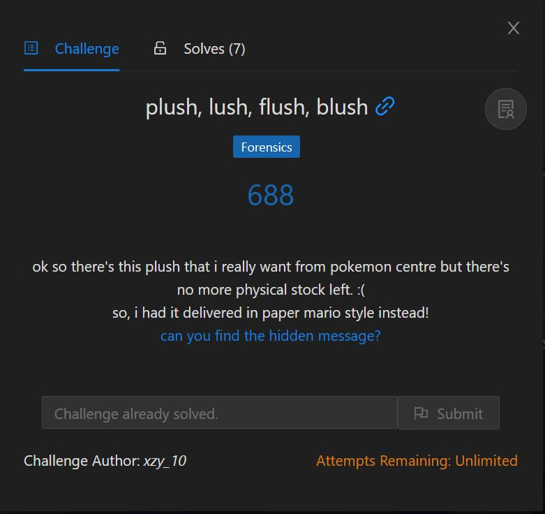
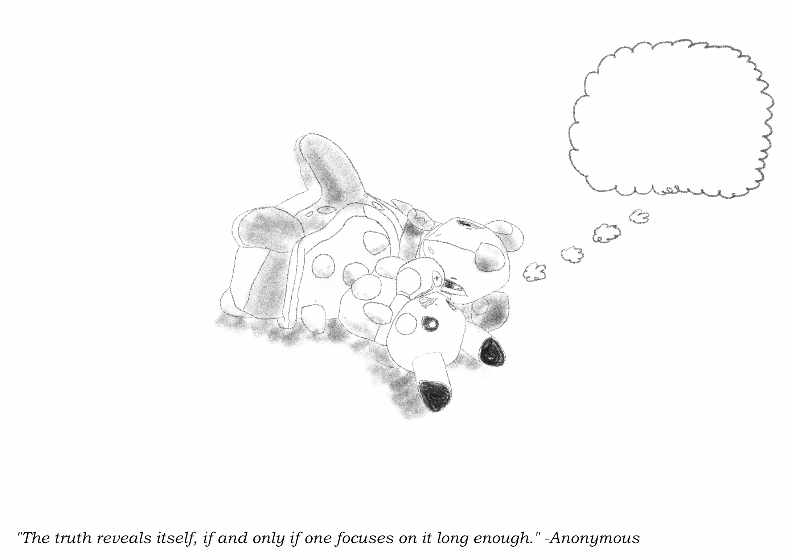
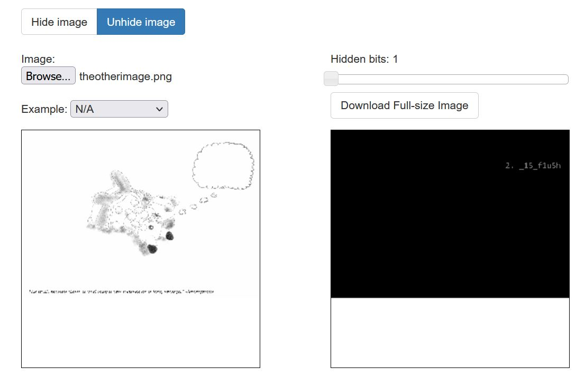
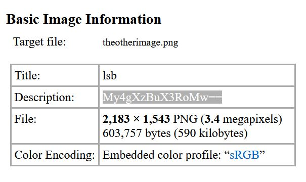

# plush, lush, flush, blush

<p align = "center"></p>

We were given pokemoncentredelivery.zip, and I got stuck at this challenge for quite some time, as I thought that I was supposed to open the plush that is password protected. Turns out it wasn't.

I took the zip file to <a href = "https://gchq.github.io/CyberChef/">CyberChef</a> and used the Extract Files option, allowing me to yank out 2 images which were hidden there all along. One was a really *sus* image that looks corrupted (I'll call this the jpg file), and the other file screams steganography (and I'll call this the png file).

<p align = "center"></p>

<p align = "center"></p>

For the first part of the flag, scrolling through the text representation of the jpg file using Notepad gave me this.

```
START{2asJNyG9Ab2paGsc6vAMxt8515DWUJ3TQgJ9ppZ5sDVQ2c4H5iB1b3JdQ9k7CpAT5N4djP2viCSA311XD7mUU6DnaZccEDKF2xvA1NX64Rh5fiEU7HhVsFWBTNZibsvwJkeG5j4sMgDf31bqhp732e1wa887Kj8AUmStr3ymjsBARbpWXFTBcRrsoynATVqo76wnsmLe1E3gfwB9wPoveEUm8AdEvVuBhKMkP8dSvV7rRGxhzV63Xvw1Bi7qp9f3XwJCE4PS94YDeynr557tPmeY4sYTL6BLuC}END
```

Decoding it, once again using <a href = "https://gchq.github.io/CyberChef/">CyberChef</a>'s From Base58 function, gives me this.

```
1. A plush.

Here lies a IRS{plu5h
Lush on the Soft Bed
Its eyes wander
over the sky
asking itself
Meta questions.
But its thoughts are just
as invisible as the others

What can you do
to make it clear
to others?
```

I also initially thought that there are more parts of the flag that can be found in the jpg file, but turns out I was just finding something that doesn't exist.

Remember what I said about the png file? We can use a steganography decoder to find the next part of the flag. In this case, this <a href = "https://incoherency.co.uk/image-steganography/#unhide">particular decoder</a> works, and we can get the second part of the flag.

<p align = "center"></p>

We know that we need to do more to obtain the complete flag, so what else can we do with images? Ah yes, the good ol' <a href = "http://exif.regex.info/exif.cgi">exif</a> to dig out information about the image. From its description, we find something encoded in base64, so we should <a href = "https://www.base64decode.org/">decode</a> it. We get the third part of the flag, "3. _0n_th3".

<p align = "center"></p>

The image information provided to us also felt strange, as it is titled "lsb". I instantly thought of LSB steganography, and using this <a href = "https://stylesuxx.github.io/steganography/">LSB steganography decoder</a>, we can find the last part of the flag "4. _gr0und}".

The final combined flag is:

```
IRS{plu5h_15_flu5h_0n_th3_gr0und}
```