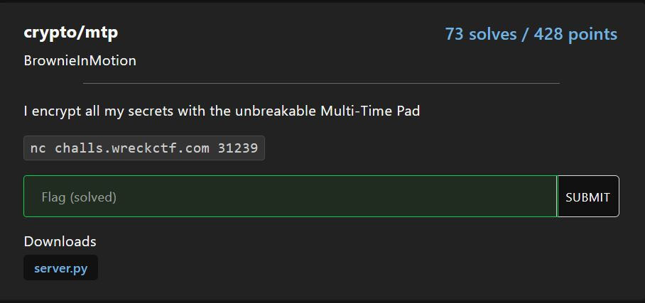
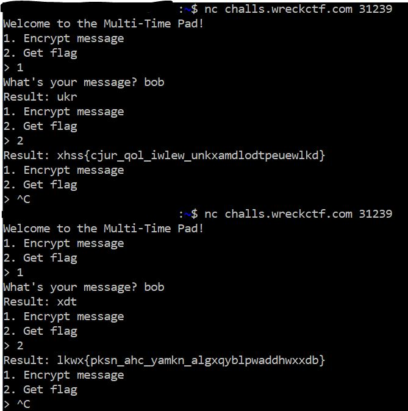

# crypto/mtp

<p align = "center"></p>

Multi-Time Pad? Sure sounds like a job for crib dragging. Except that when you look at the encryption code as provided in server.py:

```python
def encrypt(plaintext, key):
    return ''.join(
        chr(permutation[ord(letter) - ord('a')] + ord('a'))
        if letter in LETTERS
        else letter
        for letter, permutation in zip(plaintext, key)
    )

key = [list(range(26)) for _ in range(256)]
for permutation in key:
    random.shuffle(permutation)
    
print(f'Result: {encrypt(plaintext, key)}')
```

Basically a substitution cipher, but for each index of the plaintext, the mapping between all plaintext characters and encrypted characters are different. Thankfully, we can limit the number of characters we need to look at due to the following assertion:

```python
LETTERS = set('abcdefghijklmnopqrstuvwxyz')
```

The permutations for this particular substitution cipher changes each time due to random.shuffle() as seen below. 

<p align = "center"></p>

However, this does not matter to us, because we can solve for the flag despite sending at least 2 requests to the server. Note that due to the large number of permutations, we are unable to find all of the permutations in a single request because there will be connection timeout.

For letters "a" to "m":

```python
from pwn import *

target = remote("challs.wreckctf.com", 31239)
key = [[] for _ in range(40)]

data = b""
while b">" not in data:
    data += target.recv(1024)
target.sendline("1")
for i in range(0, 13):
    data = b""
    while b"?" not in data:
        data += target.recv(1024)
    target.sendline(chr(ord("a") + i) * 40)
    data = b""
    while b">" not in data:
        data += target.recv(1024)
    if b"Result:" in data:
        index = 0
        for c in data.decode().split("\n")[0].replace("Result: ", ""):
            key[index].append(chr(((ord(c) - ord("a")) % 26) + ord("a")))
            index += 1
    if i < 12:
        target.sendline("1")
target.sendline("2")
data = b""
while b">" not in data:
    data += target.recv(1024)
if b"Result:" in data:
    index = 0
    enc_flag = data.decode().split("\n")[0].replace("Result: ", "")
target.close()

decrypt_flag = ""
for i in range(len(enc_flag)):
    if enc_flag[i] not in "{}_":
        if enc_flag[i] not in key[i]:
            decrypt_flag += "?"
        else:
            decrypt_flag += chr(key[i].index(enc_flag[i]) + ord("a"))
    else:
        decrypt_flag += enc_flag[i]
print(enc_flag)
print(decrypt_flag)
```

We get:

```
flag{????_ke?_?e??e_b?cj??d?e?clk?lbk?c}
```

For letters "n" to "x":

```python
from pwn import *

target = remote("challs.wreckctf.com", 31239)
key = [[] for _ in range(40)]

data = b""
while b">" not in data:
    data += target.recv(1024)
target.sendline("1")
for i in range(13, 24):
    data = b""
    while b"?" not in data:
        data += target.recv(1024)
    target.sendline(chr(ord("a") + i) * 40)
    data = b""
    while b">" not in data:
        data += target.recv(1024)
    if b"Result:" in data:
        index = 0
        for c in data.decode().split("\n")[0].replace("Result: ", ""):
            key[index].append(chr(((ord(c) - ord("a")) % 26) + ord("a")))
            index += 1
    if i < 23:
        target.sendline("1")
target.sendline("2")
data = b""
while b">" not in data:
    data += target.recv(1024)
if b"Result:" in data:
    index = 0
    enc_flag = data.decode().split("\n")[0].replace("Result: ", "")
target.close()

decrypt_flag = ""
for i in range(len(enc_flag)):
    if enc_flag[i] not in "{}_":
        if enc_flag[i] not in key[i]:
            decrypt_flag += "?"
        else:
            decrypt_flag += chr(key[i].index(enc_flag[i]) + 13 + ord("a"))
    else:
        decrypt_flag += enc_flag[i]
print(enc_flag)
print(decrypt_flag)
```

We get:

```
????{oops_???_r?us?_?w??pq?w?o???w???o?}
```

For letters "y" to "z":

```python
from pwn import *

target = remote("challs.wreckctf.com", 31239)
key = [[] for _ in range(40)]

data = b""
while b">" not in data:
    data += target.recv(1024)
target.sendline("1")
for i in range(24, 26):
    data = b""
    while b"?" not in data:
        data += target.recv(1024)
    target.sendline(chr(ord("a") + i) * 40)
    data = b""
    while b">" not in data:
        data += target.recv(1024)
    if b"Result:" in data:
        index = 0
        for c in data.decode().split("\n")[0].replace("Result: ", ""):
            key[index].append(chr(((ord(c) - ord("a")) % 26) + ord("a")))
            index += 1
    if i < 25:
        target.sendline("1")
target.sendline("2")
data = b""
while b">" not in data:
    data += target.recv(1024)
if b"Result:" in data:
    index = 0
    enc_flag = data.decode().split("\n")[0].replace("Result: ", "")
target.close()

decrypt_flag = ""
for i in range(len(enc_flag)):
    if enc_flag[i] not in "{}_":
        if enc_flag[i] not in key[i]:
            decrypt_flag += "?"
        else:
            decrypt_flag += chr(key[i].index(enc_flag[i]) + 24 + ord("a"))
    else:
        decrypt_flag += enc_flag[i]
print(enc_flag)
print(decrypt_flag)
```

We get:

```
????{????_??y_?????_???????????????????}
```

Combining all 3 information together gives us the flag:

```
flag{oops_key_reuse_bwcjpqdweoclkwlbkoc}
```