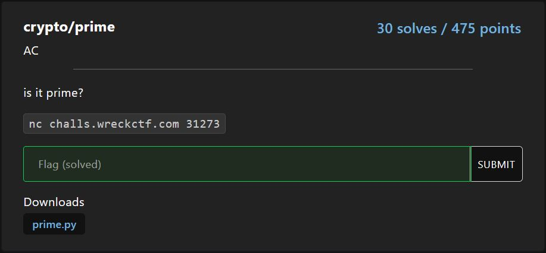

# crypto/prime

<p align = "center"></p>

The following code wants us to generate a number with bit length of at least 1020 and lesser than 1029. This number also has to be not exactly divisible by a range of numbers from 2 to 999 inclusive. 

```python
n = int(input(">> "))
n_len = n.bit_length()
if n_len<1020 or n_len>1028:
    print("no.")
    quit()
for i in range(2,1000):
    if n%i==0:
        print("no.")
        quit()
```

We look at the code below. The first line already looks like a probabilistic primality test for our generated number. If our generated number passes the primality test, the server wants us to key in 70 different primes that are factors of our generated number before we get to the flag.

```python
if all([pow(random.randrange(1,n), n-1, n) == 1 for i in range(256)]):
    a = []
    for _ in range(70):
        a.append(int(input(">> ")))
    if all([n%i==0 for i in a]):
        for i in range(len(a)):
            for j in range(i+1, len(a)):
                if math.gcd(a[i],a[j])!=1:
                    print(a[i],a[j])
                    print("no.")
                    quit()
        print(flag)
    else:
        print("no.")
        quit()
```

I initially thought the challenge was to get us generate a Carmichael's number (a composite number which passes some of the primality tests, including this one) of that specific bit length and has 70 different factors.  But looking closely, the only line of code that matters is this one:

```python
if math.gcd(a[i],a[j])!=1:
```

Then it hit me. If I submitted 70 "1"s, a[i] = 1, a[j] = 1, math.gcd(a[i], a[j]) = 1! Unquestionably, 1 is a prime /s.

The code I used is as shown below:

```python
from pwn import *
from Crypto.Util.number import *

target = remote("challs.wreckctf.com", 31273)

received = b""
while b">>" not in received:
    received += target.recv(1024)
target.sendline(str(getPrime(1024)))

for i in range(70):
    received = b""
    while b">>" not in received:
        received += target.recv(1024)
    target.sendline("1")

received = b""
while b"\n" not in received:
    received += target.recv(1024)
print(received)

target.close()
```

This gives us the flag:

```
flag{yep_it's_definitely_prime}
```