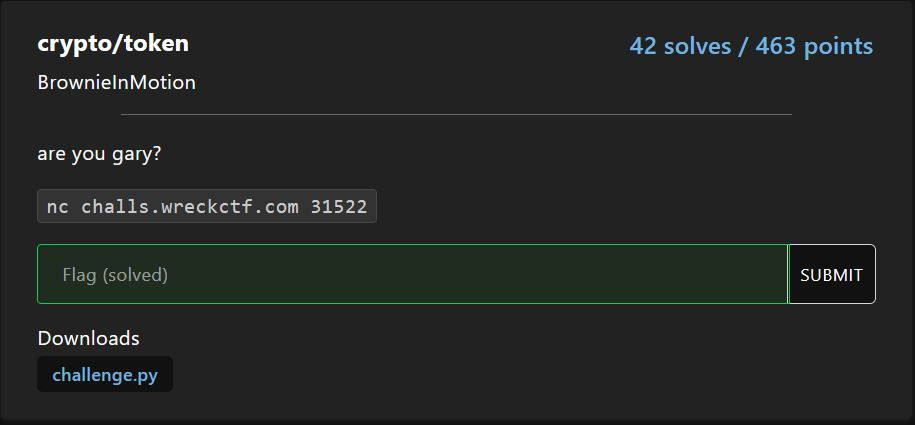
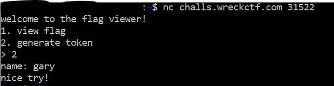

# crypto/token

<p align = "center"></p>

The source code fooled me. You thought it was related to the famous ECB vulnerability, but it was me, <s>Dio</s> Gary!

```python
def encrypt(name):
    cipher = AES.new(KEY, AES.MODE_ECB)
    return cipher.encrypt(pad(name.encode(), AES.block_size)).hex()

def decrypt(ciphertext):
    cipher = AES.new(KEY, AES.MODE_ECB)
    result = unpad(cipher.decrypt(bytes.fromhex(ciphertext)), AES.block_size)
    return result.decode()
```

In short, we need to get the token which is equivalent to the AES-encrypted string "gary" and input that token to get the flag. The problem is that we can only generate token for any string other than "gary".

<p align = "center"></p>

Except the problem was never a problem. Look at the encrypt() code again. We can just pad the string "gary" to bypass the string check for generate token!

This was the code I used:

```python
from pwn import *
from Crypto.Util.Padding import pad
from Crypto.Cipher import AES

target = remote("challs.wreckctf.com", 31522)

received = b""
while b">" not in received:
    received += target.recv(1024)
target.sendline("2")
received = b""
while b":" not in received:
    received += target.recv(1024)
target.sendline(pad(b"gary", AES.block_size).decode())
received = b""
while b">" not in received:
    received += target.recv(1024)
secret = received.decode()
target.sendline("1")
received = b""
while b":" not in received:
    received += target.recv(1024)
target.sendline(secret.split("\n")[0].replace("here's your token: ", "")[:32])
received = b""
while b"\n" not in received:
    received += target.recv(1024)
print(received.decode().split("\n")[0])
target.close()
```

This gives us the flag:

```
flag{gary_gary_gary_gary_gary_gary}
```