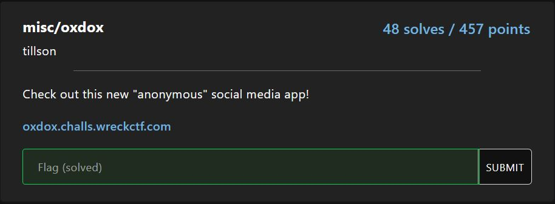
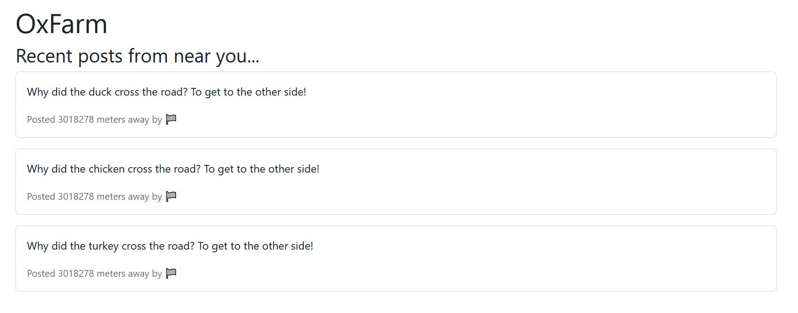
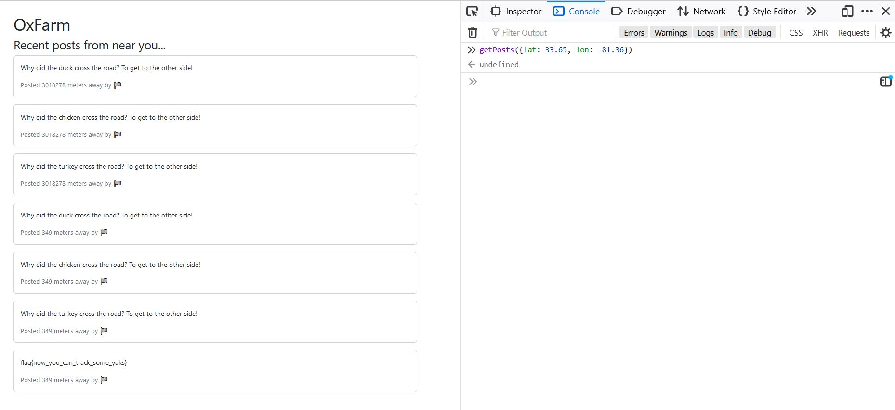

# misc/oxdox

<p align = "center"></p>

The <a href = "https://oxdox.challs.wreckctf.com/">anonymous social media app</a> in question looks interesting. First thing they ask you is your location, which would not affect the challenge if you enable or disable geolocation. Looking at the UI below, the webpage seems to tell us that we need to get closer to the flag to obtain it.

<p align = "center"></p>

They have a very interesting javascript code as shown below:

```javascript
<script>
  function getPosts(loc) {
    $.post('/api/getPosts', loc, function (data) {
      data.forEach(function(post) {
        $('#posts').append(`
          <div class="card mb-3">
            <div class="card-body">
              <p class="card-text">${post.post}</p>
              <p class="card-text"><small class="text-muted">Posted ${post.distance.toFixed(0)} meters away by ${post.user}</small></p>
            </div>
          </div>
        `)
      });
   });
  }
  $(document).ready(function () {
    if ("geolocation" in navigator){ 
      // getting your browser's location is for visual effect, whether it is enabled/disabled does not affect the problem
      navigator.geolocation.getCurrentPosition(function(position){ 
          getPosts({lat: position.coords.latitude, lon: position.coords.longitude});
      }, function(err) {
        getPosts({lat: 32, lon: -49});
    });
    }else{
      getPosts({lat: 32, lon: -49});
    }
  });
</script>
```

We can use the function getPosts() that is provided and key it onto the console using the Inspect function. Via guess-and-check, we found that the flag is close to latitude of 33.65 and longitude of -81.36.

<p align = "center"></p>

The flag is revealed to be:

```
flag{now_you_can_track_some_yaks}
```