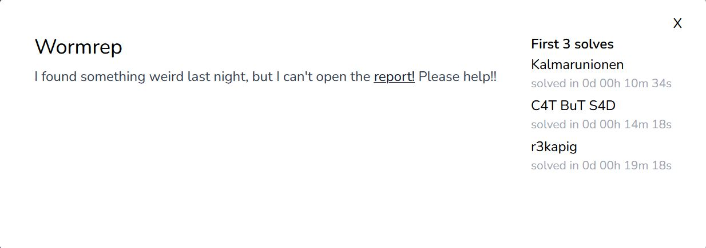
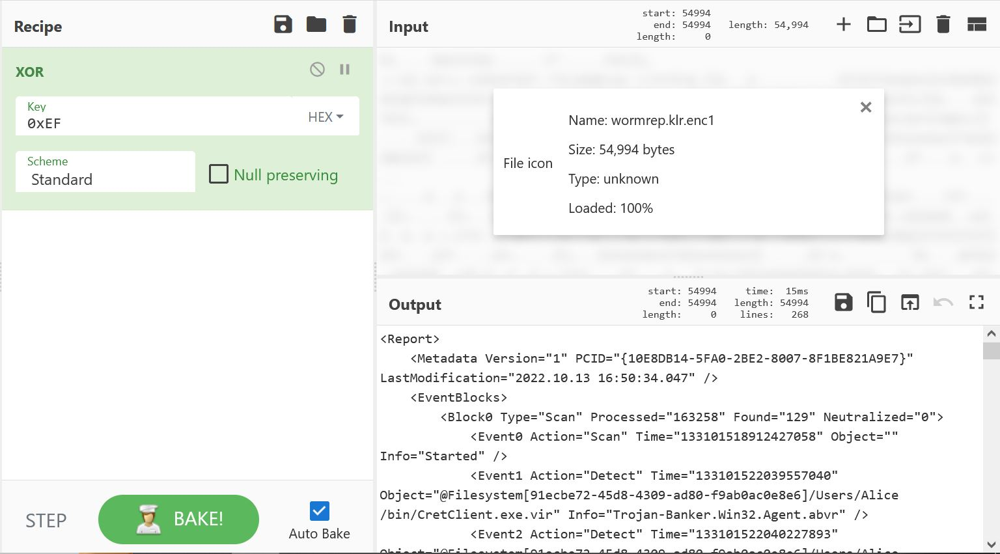

# misc/Wormrep

<p align = "center"></p>

The challenge provides us with a report with a suspicious file extension <i>.klr.enc1</i>. A quick search on our best friend Google tells us that the file is really a virus scan report produced by Kaspersky Antivirus, and that everyone seems to have problems opening them for some reason. I found an <a href = "https://alt.comp.anti-virus.narkive.com/OrDIKhSr/kaspersky-rescue-disk-report-can-t-see-full-paths">interesting forum page</a> from a few years back which points that the file is only XOR-obfuscated, highlighting that there were many groups of 0xCF hex bytes in the "encrypted" file. XORing the file by 0xEF gives us a readable XML formatted report.

<p align = "center"></p>

The flag is found within the report:

```
ASIS{N07_@ll_v!ru535_@r3_AS_8@d_a5_cov!d}
```