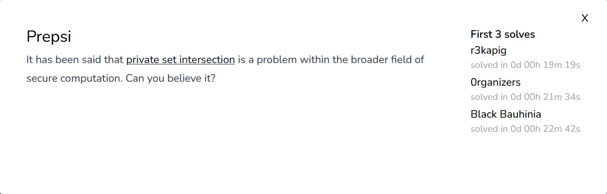

# ppc/Prepsi

<p align = "center"></p>

Yea, what about private set intersection? We don't actually need to care about that. The following code provided by the challenge seems to be comparing the Hamming distance <i>d</i> and the number of similar characters <i>i</i> between the flag and randomly generated strings.

```python
A = set(list(flag[5:-1]))
while True:
	body = randstr(40)
	B = set(list(body))
	fake_flag = 'ASIS{' + f'{body}' + '}'
	print(f'{fake_flag}, d = {distance(flag, fake_flag)}, i = {len(A.intersection(B))}')
```

As we look through output.txt (and removing an extra new line along the way), we realise that we only need to care about the Hamming distance, given the large dataset provided to us. We can create a set of all possible characters for each index of the flag. Then, for each randomly generated string where <i>d</i> is equal to its length (40), at each index, we remove that character from the set. This is as shown by the following code:

```python
allstr = set("0123456789abcdefghijklmnopqrstuvwxyzABCDEFGHIJKLMNOPQRSTUVWXYZ!?@-_{|}")

body = [allstr.copy() for _ in range(40)]

with open("output.txt", "r") as f:
    for line in f:
        if int(line[52:54]) == 40:
            for i in range(40):
                body[i].discard(line[i + 5])
    f.close()

print("ASIS{" + "".join([c.pop() for c in body]) + "}")
```

Our code outputs the flag as such:

```
ASIS{Pr!v4t3_5E7_iNTeRS3c710N_p4St_Or_Pr3sEnT}
```

