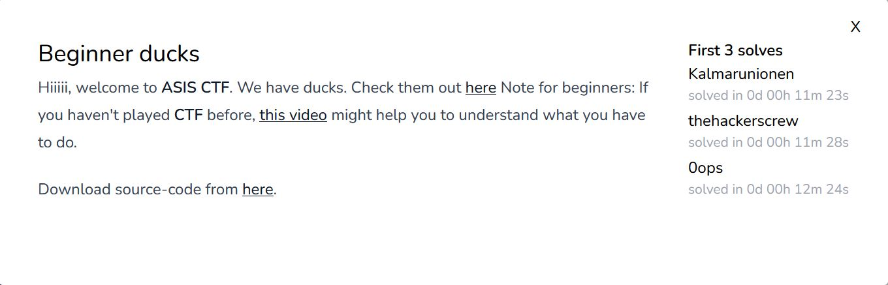
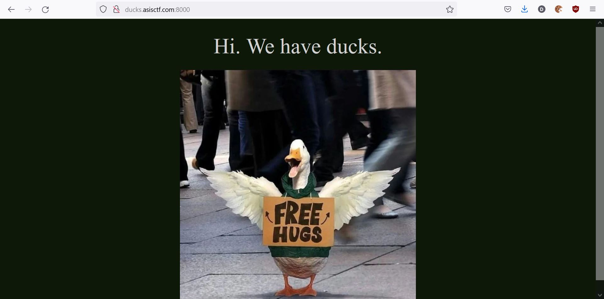
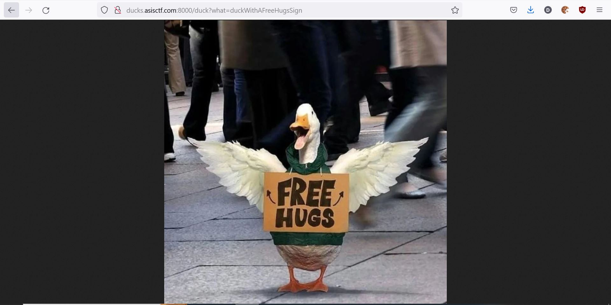
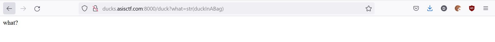
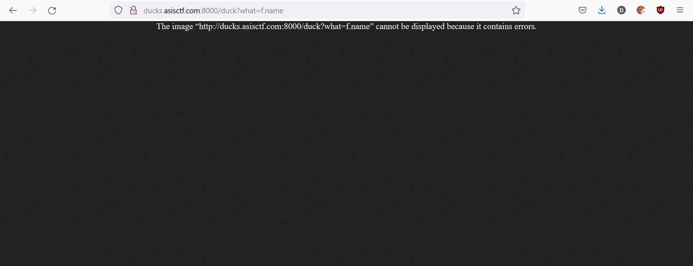

# web/Beginner ducks

<p align = "center"></p>

Imagine being a beginner web exploitation question without any SQL injection, command injection or SSTI. Best of all, "this video that might help" was entirely irrelevant to the topic at hand, where the video described some PHP vulnerabilities yet there was no PHP to be seen in this challenge. In the end, the ducks took the souls of those beginners and they were never seen at any CTFs ever again. Jokes aside, the challenge stumped me for quite some time as I stared at the webpage below.

<p align = "center"></p>

Looking through the source code gave us some idea on as to what was going on. As seen below, there is a route "/duck" which tries to get the value of the argument <i>what</i>. The regular expression on <i>what</i> is literally just an <i>.isalpha()</i> check while allowing dots and disallowing other special characters including spaces. If we pass the regex, we are able to open a file based on what <i>what</i> is. The <i>eval()</i> function sounds all kinds of alarms, as it is well known to be a security issue no matter how much we try to sanitize the string.

```python
@app.route('/duck')
def retDuck():
	what = request.args.get('what')
	duckInABag = './images/e146727ce27b9ed172e70d85b2da4736.jpeg'
	duckLookingAtAHacker = './images/591233537c16718427dc3c23429de172.jpeg'
	duckWithAFreeHugsSign = './images/25058ec9ffd96a8bcd4fcb28ef4ca72b.jpeg'

	if(not what or re.search(r'[^A-Za-z\.]',what)):
		return 'what?'

	with open(eval(what),'rb') as f:
		return Response(f.read(), mimetype='image/jpeg')
```

We can access the 3 variables shown above through the <i>eval()</i> function as such:

<p align = "center"></p>

However, trying to utilise MRO or executing a function is not possible because of regex preventing the use of underscores and brackets before we can evaluate our variable <i>what</i>.

<p align = "center"></p>

I also noticed that towards the end of the code, the following 2 files are opened. Since dots are allowed by the regex, we are able to use attributes of classes.

```python
with open('./index.html') as f:
	indexTemplate = f.read() 
with open('/flag.txt') as f:
	flag = f.read()
```

We can access the flag through the <i>eval()</i> function as it is an existing variable. However, we are supposed to parse the name of the file that stores the flag, not the flag itself so that we can receive the contents of the flag through the HTTP response sent to us. Thankfully for us flag.txt is the last file to be opened and they also forgot to close it, meaning we can access the file through its variable <i>f</i>.

<p align = "center"></p>

Oh no! We still cannot access the flag, but we are almost there. We note that the mimetype used for the HTTP response is image/jpeg while our flag is literally a plaintext. We send the following code through our shell:

```sh
curl http://ducks.asisctf.com:8000/duck?what=f.name -H "Content-Type: text/plain"
```

This gives us:

```
ASIS{run-away-ducks-are-coming-🦆🦆}
```